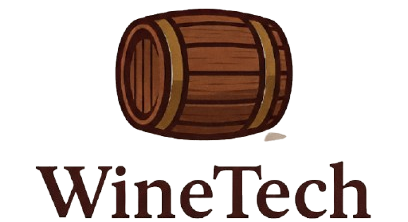

# WineTech 



## 📖 Descrição do Projeto  

O **WineTech** é uma solução IoT inteligente desenvolvida para monitoramento contínuo da temperatura e umidade durante o processo de envelhecimento de vinhos em barris.  

Por meio de sensores integrados a uma plataforma online, o sistema garante estabilidade ambiental, coleta dados em tempo real, gera relatórios estratégicos e envia alertas automáticos sempre que os parâmetros ideais são comprometidos.  

Dessa forma, a **WineTech** assegura a máxima qualidade dos vinhos, reduz perdas financeiras, protege o investimento das vinícolas e moderniza o processo de gestão de caves e adegas.  

---

## 🍇 Sobre a Empresa  

A **WineTech** nasce da união entre expertise em **IoT** e paixão pela **Tenologia**, com foco em levar inovação tecnológica ao setor vitivinícola brasileiro.  
Nossa missão é ajudar vinícolas e produtores a garantirem que cada barril atinja seu **potencial máximo**, preservando a qualidade do vinho e fortalecendo a competitividade do mercado nacional no cenário global.  

Clientes potenciais incluem desde grandes grupos como **Salton, Miolo Wine Group, Casa Valduga e Pizzato**, até pequenos produtores que buscam tecnologia para proteger sua produção.  

---

## 🌍 Contexto  

O envelhecimento em barris é uma etapa crítica, onde o vinho adquire complexidade, corpo e longevidade. Porém, essa fase também é a mais vulnerável: variações de temperatura e umidade podem comprometer a qualidade da safra inteira.  

- **Temperatura acima de 22°C** pode oxidar o vinho e transformá-lo em vinagre, resultando em perdas de até **R$ 20.000 por barril**.  
- **Umidade abaixo de 70%** provoca ressecamento dos barris, aumentando a evaporação e o prejuízo anual em até **R$ 2.000 por barril**.  
- No Brasil, a instabilidade climática representa um desafio ainda maior do que em países de clima frio e estável, como na Europa.  

O setor vitivinícola brasileiro movimentou **R$ 3,8 bilhões em 2022** e continua crescendo, mas precisa de tecnologia para proteger esse investimento e competir em qualidade internacional.  

---

## 🎯 Objetivos  

- **Maximizar a qualidade e o lucro:** permitir que o vinho atinja seu potencial máximo de mercado.  
- **Evitar perdas catastróficas:** prevenir prejuízos de até R$ 20.000 por barril.  
- **Otimizar a gestão da adega:** automatizar a coleta de dados e reduzir falhas humanas.  
- **Gerar inteligência de negócio:** disponibilizar relatórios completos para auditorias, planejamento e decisões estratégicas.  
- **Aumentar a eficiência operacional:** liberar a equipe para focar na arte de vinificação, enquanto o sistema garante a estabilidade dos barris.  

---

## 🤝 Contribuição  

Para contribuir com este projeto:  

```bash
# 1. Clone o repositório
git clone https://github.com/usuario/RedShot.git

# 2. Atualize o repositório diariamente
git pull

# 3. Faça as alterações necessárias e empacote
git add .

# 4. Escreva uma mensagem de commit
git commit -m "nome_da_alteração"

# 5. Envie suas alterações
git push

   

   
   
